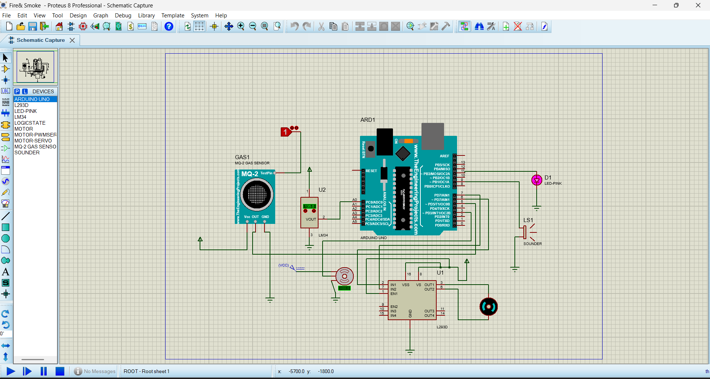

# 🔥 Arduino-Based Fire & Smoke Detection System

This is a smart fire safety system developed using *Arduino UNO* and simulated on *Proteus*. The system provides a two-level response based on smoke detection and temperature rise.

---

## 🚨 Features

### ✅ Level 1: Smoke Detected (Early Warning)
- *Sensor:* MQ-2 Gas Sensor
- *Actions:*
  - LED blinks
  - DC motor with fan turns ON to disperse smoke

### 🔥 Level 2: Smoke + High Temperature (Fire Condition)
- *Sensors:* MQ-2 + LM34 Temperature Sensor
- *Actions:*
  - LED blinks
  - Buzzer activates
  - Servo rotates to simulate turning on a water tap

---

## 🧠 Working Logic

- *Temperature Threshold:* ~134°F (≈56°C)
- *Servo Angle:*
  - 90° (safe state / fan blowing smoke)
  - 0° (fire state / water tap simulation)
- *Safe State Reset:* All components reset if no danger is detected.

---

## 🛠 Components Used

- MQ-2 Gas Sensor
- LM34 Temperature Sensor
- Arduino Uno
- Servo Motor
- DC Motor (driven via L293D)
- Buzzer
- LED
- Breadboard and connecting wires

---

## 📂 Project Files

- fire_smoke_detection.ino - Arduino source code
- Proteus_Simulation.png - Schematic image
- README.md - Project overview

---

## 🧪 Simulation

Simulated and tested in *Proteus*. Make sure all sensor modules and libraries are correctly set up in your Proteus environment.

---

## 📸 Screenshot

---

## 🛡 Future Improvements

- Add flame sensor for higher reliability
- IoT integration for alerts to phone
- Real relay module to control water pump

---

## 👥 Contributors / Credits

This project was developed by:

- [Tanusha](https://github.com/Tanusha985)
- [Md Adnan Khan](https://github.com/adnann3)

Special thanks to our mentor Dr Divya Sharma for guidance.

---

## 🙌 Contribution

Feel free to fork, improve, or suggest changes. Pull requests are welcome!
